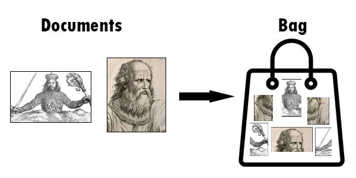
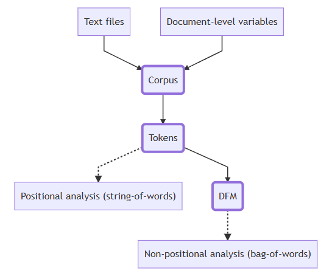

# Hands-On Methods for Text-as-Data Research

# Rules of the Workshop

The workshop is intentionally applied. This means that on your laptop, you should download and launch the script. Then:

* Follow the instructor by executing the code and modifying it as needed.

* Complete the exercises.

* Ask questions.

* If you feel like the workshop is moving too slowly, go ahead and start the exercises! 

The script is extensively commented, so you can return to any part of it later.

::: {.text-center}
[Download script](https://artur-baranov.github.io/text-as-data/index.qmd){.btn .btn-primary .btn role="button" download="workshop_qta.qmd" style="width:200px" target="_blank"}
:::

In case you do not have RStudio installed, see the instruction [here](https://artur-baranov.github.io/install-R). 

# Agenda

-   ...

-   ...

# Brief Coding Recap

First, we start with a quick recap of RStudio.

## Code Chunk

To insert a **Code Chunk**, you can use `Ctrl+Alt+I` on Windows and `Cmd+Option+I` on Mac. Run the whole chunk by clicking the green triangle, or one/multiple lines by using `Ctrl + Enter` or `Command + Return` on Mac.

```{r}
print("Code Chunk")
```

## Function and Arguments, Data structures

Most of the **functions** we want to run require an **argument** For example, the function `print()` above takes the argument "Code Chunk".

```{r}
#| eval: false

function(argument)
```

For example, consider an **object**. Try printing it by highlighting the required line and pressing `Ctrl+Enter` or `Cmd+Return` on Mac.

```{r}
#| results: hold

number = 1
number
print(number)

word = "Northwestern"
word
```

## Libraries

Quite frequently, we use additional libraries to extend the capabilities of R. In this workshop we highly relying on `quanteda` and `tidyverse`. Please, if you do not have these libraries, install them now.

Check if you have them installed

```{r}
#| eval: false

c("tidyverse", "quanteda", "quanteda.textstats") %in% rownames(installed.packages())
```
If you do not, please install them using the chunk below. **Run it only once!**. Instead of `...` insert the package that is missing. 

```{r}
#| eval: false

install.packages("...")
```

Now, load them into the current R session.

```{r}
#| message: false

library(tidyverse)
library(quanteda)
library(quanteda.textstats)
```


# Quanteda Objects

Quanteda is a widely used R package for quantitative text analysis (QTA), developed by fellow political scientists. It stands for quantitative analysis of textual data.

## Corpus

The collections of documents is called corpus. For example, imagine you have two documents.

```{r}
simple_corpus = corpus(c("A corpus is a set of documents.",
                         "This is the second document in the corpus"))

simple_corpus
```

Additionally, you can add document-level variables. For example, an authorship, number of characters, regions, etc etc. Let's add number of characters in each document. What does `$` operator do? 

```{r}
docvars(simple_corpus)$charcount = nchar(simple_corpus)
```

Let's see the result

```{r}
docvars(simple_corpus)
```

In other words, quanteda stores information about the text separately from the text itself. Important for the future manipulations!

## Tokens
 
Each document consists of tokens. When we tokenize a corpus, the text is segmented into tokens (words or sentences) based on word boundaries. In other words, each word in the document is separated into its own token.

```{r}
simple_toks = tokens(simple_corpus,
                     remove_punct = TRUE)

simple_toks
```

## Document-feature matrix

Represents frequencies of features in documents in a matrix, for example, tokens. Let's constructs a document-feature matrix (DFM) from a tokens object. Run the chunk, take a look on the result. What did DFM do to our data?

```{r}
simple_dfm = dfm(simple_toks)

simple_dfm
```

# Bag-of-Words approach

We completely destroy the order of words in our corpus. This is a quick visualization.

 change to URL

This allows us to, say, calculate the most frequent words in the whole corpus.

```{r}
topfeatures(simple_dfm, n = 10)
```
change to URL


# Inaugural Speeches

Quanteda has some datasets embedded directly into the package. Let's explore one of these - the presidential inaugural address texts.

```{r}
data_corpus_inaugural 
```

For details about the corpus, you can use the `summary()` function. Types are unique tokens, and tokens are usually words. In this way, we can get a sense of how diverse the president’s vocabulary is.

```{r}
#| eval: false

summary(data_corpus_inaugural)
```

If you want to get some specific information about the corpus, you can use the following commands.

-   `ntoken()`, number of tokens in each document

-   `ndoc()`, number of documents in corpus

-   `docvars()`, access document-level variables

Let's these together

```{r}
#| eval: false

...
```

## Most Similar Addresses

Imagine you are interested in measuring the similarity between addresses starting in 2000. To do this, you will need to:

*   Subset corpus

*   Preprocess text

*   Create a document-feature matrix

*   Calculate similarity/distance measures

First, subset the corpus based on the document-level variable `Year`

```{r}
data_inaug_2000 = data_corpus_inaugural %>% 
  corpus_subset(Year >= 2000)
```

Then, check how many speeches are left.

```{r}
ndoc(data_inaug_2000)
```

Now, let’s process the text. This step is **crucial** for text analysis. If you do not preprocess the text, punctuation (commas, periods), symbols, or numbers can influence the calculation of various measures.

```{r}
toks_inaug_2000 = data_inaug_2000 %>%
  tokens(remove_punct = TRUE,
         remove_symbols = TRUE,
         remove_numbers = TRUE) 

toks_inaug_2000[1]
```

Additionally, some words may appear very frequently, such as articles (a, the) and conjunctions (and, if). These are called stopwords. It is good practice to remove them, as they convey little information about the similarity between texts but can significantly affect the results.

```{r}
toks_inaug_2000 = toks_inaug_2000 %>%
  tokens_remove(stopwords("en")) 

toks_inaug_2000[1]
```

Lastly, we stem the tokens. Stemming means truncating words so different version of the words becomes unified. Use `tokens_wordstem()` for stemming. Let's try together.

```{r}
#| eval: false

tokens("citizen citizens run running") %>%
  ...
```

So, stem our tokens.

```{r}
toks_inaug_2000 = toks_inaug_2000 %>%
  tokens_wordstem()

toks_inaug_2000[1]
```

Good news! Last step. Finally, we can create Document-feature matrix out of processed text.

```{r}
dfm_inaug_2000 = toks_inaug_2000 %>%
  dfm()

dfm_inaug_2000
```

Side note, a fascinating feature of quanteda is that, even after many manipulations on the corpus, the document-level variables are accessible.

```{r}
docvars(dfm_inaug_2000)
```

Now, let's calculate the distance between texts. By default, this is measured using Euclidean distance. Interpreting it is quite straightforward: the larger the value, the less similar the texts are.

```{r}
address_distance = textstat_dist(dfm_inaug_2000)
address_distance
```

To simplify the task of interpretation, we can visualize the results. The code below demonstrates the power of `tidyverse` - which is helpful, but out of the scope of this workshop. If you're interested more in this, take a look on the [tutorial](https://r4ds.hadley.nz/data-tidy.html). 

```{r}
df_distance = address_distance %>%
  as.matrix() %>%
  as.data.frame() %>%
  rownames_to_column("doc1") %>%
  pivot_longer(cols = -doc1, names_to = "doc2", values_to = "distance") 


ggplot(df_distance, aes(doc1, doc2, fill = distance)) +
  geom_tile() +
  labs(title = "Textual Distance Between Presidential Inaugural Addresses (2001-2025)",
       x = NULL,
       y = NULL,
       fill = "Distance") +
  scale_fill_viridis_c() +
  theme(axis.text.x = element_text(angle = 45, hjust = 1))
```

What are the most "distant" speeches?

```{r}
df_distance %>%
  group_by(doc1) %>%
  slice_max(distance, n = 1)
```

::: {.callout-tip icon="false"}
## Exercises

Now, let’s transform the corpus to the level of paragraphs rather than whole speeches. This provides a more granular overview of the left corpus.

```{r}
corpus_obama = data_corpus_inaugural %>%
  corpus_subset(President == "Obama") %>%
  corpus_reshape(to = "paragraphs")
```

How many documents are there now? Why?

```{r}
ndoc(corpus_obama)
```

Get a more detailed overview with the `summary()` function.

```{r}
#| eval: false

...(corpus_obama)
```

```{r}
corpus_obama %>% 
  tokens() %>%
  dfm() %>%
  textstat_simil() %>%
  as.data.frame() %>%
  arrange(-correlation)
```

```{r}
corpus_obama["2009-Obama.36"] %>%
  print(max_nchar = -1)
```

```{r}
corpus_obama["2013-Obama.29"] %>%
  print(max_nchar = -1)
```


:::


Explore `corpus_reshape()`. Reshape `data_corpus_inaugural`to the level of sentences and store this object as `data_inaug_sentences`. What is the number of sentences (=number of documents) in this text corpus?

```{r}
data_corpus_inaugural_sent = data_corpus_inaugural %>% corpus_reshape(to = 'sentences')
ndoc(data_corpus_inaugural)
```


Exercise

Distance between texts (textstat_dist): leave only democrat, reshape to paragraphs, use textstat_dist to find the closest paragraphs across presidents 

Vocabulary + frequences 

Keyness analysis (week 6): words that are used by republicans/democrats


Naive Bayes (textmodel_nb, week 7)

Topic modeling


Sentiment: https://tutorials.quanteda.io/advanced-operations/targeted-dictionary-analysis/

ChatGPT outperforms crowd workers for text-annotation tasks paper

# Check List

- [ ] R doesn't scare me anymore

