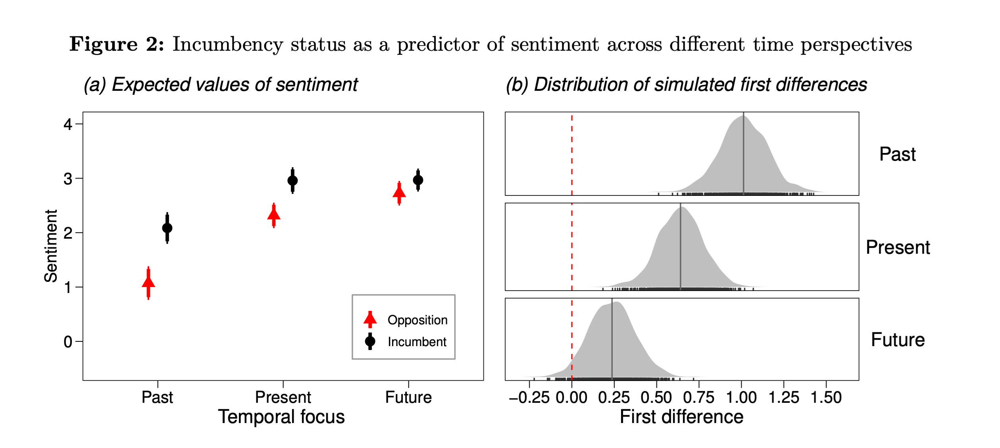
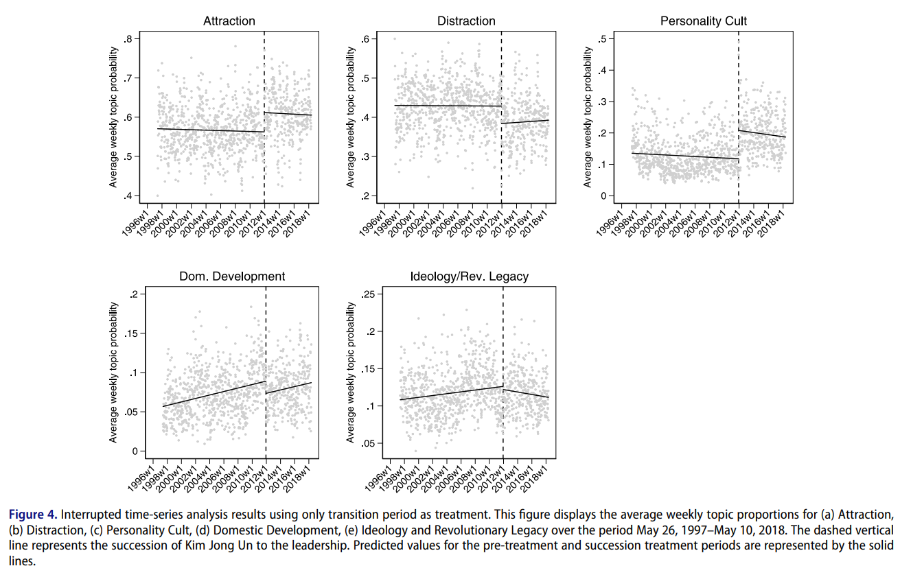
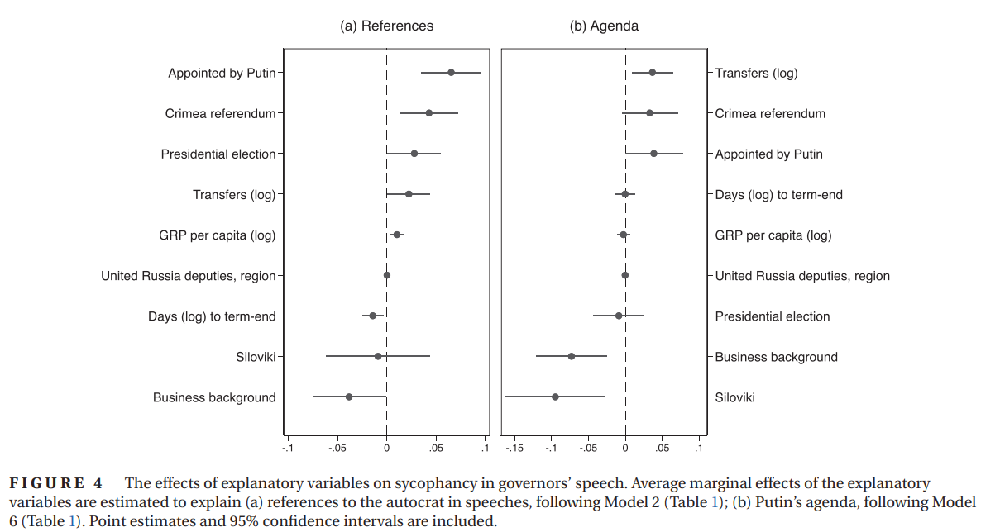

::: {style="text-align: center"}
##  Hands-on Methods for Text-as-Data Research {.center .smaller}

::: columns

::: {.column width="50%"}

**Artur Baranov, PhD Candidate**  
Department of Political Science, Northwestern University  
<artur.baranov@u.northwestern.edu>  

:::

::: {.column width="50%"}

**Instructions**

1. Open URL (or Scan QR code)

2. Prepare RStudio

:::

:::

::: columns

::: {.column width="50%"}
<br><br>
Open: [artur-baranov.github.io/text-as-data](https://artur-baranov.github.io/text-as-data)

:::

::: {.column width="50%"}

```{r}
#| echo: false
#| fig-align: right

library(qrcode)
qr_code('https://artur-baranov.github.io/text-as-data') |>
  plot()

```

:::

:::


<center>January 20th, 2026</center>

:::


## Motivation (i)

:::: {.columns}

::: {.column width="70%"}
<span style="font-size: 0.7em;">
How do government and opposition parties differ in their sentiment in statements on the past, present, and future [(Mueller, 2022)](https://doi.org/10.1086/715165)?

</span>




<!-- A value above 0 implies that incumbents employ more positive sentiment than opposition parties in a given class. On the one hand, all simulated first differences between incumbents and opposition parties exceed 0 for statements on the past and present, implying that incumbents employ more positive sentiment than the opposition -->

:::

::: {.column width="30%"}
<div style="font-size: 0.5em;">
**In the Meantime:** 

Open URL & Prepare RStudio 

[artur-baranov.github.io/text-as-data](https://artur-baranov.github.io/text-as-data) 

</div>

```{r}
#| echo: false
#| fig-align: center
#| out-width: "100%"
#| fig-width: 6

qr_code('https://artur-baranov.github.io/text-as-data') |>
  plot()

```


:::

::::


## Motivation (ii)


:::: {.columns}

::: {.column width="70%"}
<span style="font-size: 0.7em;">
How do autocracies adapt their political messaging during periods of leadership succession 
[(Boussalis et al, 2023)](https://doi.org/10.1080/10758216.2021.2012199)?

</span>




<!-- Use propaganda mainly to signal overwhelming power through repetitive messaging (where content doesn't matter much), OR Use propaganda strategically for legitimation by adjusting content in meaningful ways to respond to political contexts and crises -->

:::

::: {.column width="30%"}
<div style="font-size: 0.5em;">
**In the Meantime:** 

Open URL & Prepare RStudio 

[artur-baranov.github.io/text-as-data](https://artur-baranov.github.io/text-as-data) 

</div>
```{r}
#| echo: false
#| fig-align: center
#| out-width: "100%"
#| fig-width: 6
qr_code('https://artur-baranov.github.io/text-as-data') |>
  plot()

```


:::

::::

## Motivation (iii)


:::: {.columns}

::: {.column width="70%"}
<span style="font-size: 0.7em;">
Under what conditions elites "overpraise" the ruler and imitate their rhetoric [(Baturo et al, 2025)](https://doi.org/10.1111/ajps.12909)?

</span>




<!-- latent semantic scaling analysis -->

:::

::: {.column width="30%"}
<div style="font-size: 0.5em;">
**In the Meantime:** 

Open URL & Prepare RStudio 

[artur-baranov.github.io/text-as-data](https://artur-baranov.github.io/text-as-data) 

</div>
```{r}
#| echo: false
#| fig-align: center
#| out-width: "100%"
#| fig-width: 6
qr_code('https://artur-baranov.github.io/text-as-data') |>
  plot()

```


:::

::::

## Text Analysis Assumptions


:::: {.columns}

::: {.column width="70%"}
::: {.incremental}

<div style="font-size: 0.7em;">

* Texts represent an observable implication of some underlying characteristic of interest

  + An attribute of the author
  + A sentiment or emotion
  + Salience of a political issue

* Texts can be represented through extracting their features

  + Most common is the **bag of words** assumption
  + Many other possible definitions of “features” (e.g. word embeddings)
  
* A **document-feature matrix** can be analyzed using quantitative methods to produce meaningful and valid estimates of the underlying characteristic of interest

[(Benoit, 2018)](https://kenbenoit.net/assets/courses/tcd2018qta/QTA_TCD_Day1.pdf)

</div>
:::


:::

::: {.column width="30%"}
<div style="font-size: 0.5em;">
**In the Meantime:** 

Open URL & Prepare RStudio 

[artur-baranov.github.io/text-as-data](https://artur-baranov.github.io/text-as-data) 

</div>
```{r}
#| echo: false
#| fig-align: center
#| out-width: "100%"
#| fig-width: 6
qr_code('https://artur-baranov.github.io/text-as-data') |>
  plot()

```


:::

::::


## Text Analysis Principles


:::: {.columns}

::: {.column width="70%"}
::: {.incremental}

<div style="font-size: 0.7em;">


1. All quantitative models for textual analysis are wrong – but some are useful
2. Quantitative methods for text amplify resources
3. There is no globally best method for automated text analysis
4. Validate, validate, validate (!!!)

[(Grimmer and Stewart, 2013)](https://doi.org/doi:10.1093/pan/mps028)

</div>
:::


:::

::: {.column width="30%"}
<div style="font-size: 0.5em;">
**In the Meantime:** 

Open URL & Prepare RStudio 

[artur-baranov.github.io/text-as-data](https://artur-baranov.github.io/text-as-data) 

</div>
```{r}
#| echo: false
#| fig-align: center
#| out-width: "100%"
#| fig-width: 6
qr_code('https://artur-baranov.github.io/text-as-data') |>
  plot()

```


:::

::::

## This Workshop


:::: {.columns}

::: {.column width="70%"}
::: {.incremental}

<div style="font-size: 0.7em;">


* is applied
  
  + follow and execute the code
  + do the exercises
  + ask questions
  
* focuses on "traditional" QTA methods
  
  + we will cover AI only briefly
  + otherwise, we have to have another class

* Time to turn to practice

</div>
:::


:::

::: {.column width="30%"}
<div style="font-size: 0.5em;">
**In the Meantime:** 

Open URL & Prepare RStudio 

[artur-baranov.github.io/text-as-data](https://artur-baranov.github.io/text-as-data) 

</div>
```{r}
#| echo: false
#| fig-align: center
#| out-width: "100%"
#| fig-width: 6
qr_code('https://artur-baranov.github.io/text-as-data') |>
  plot()

```


:::

::::

